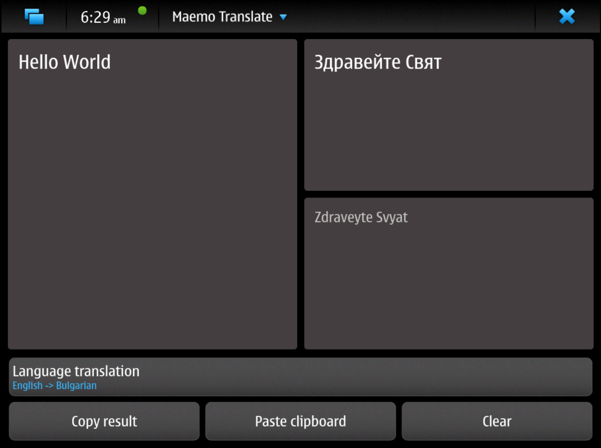
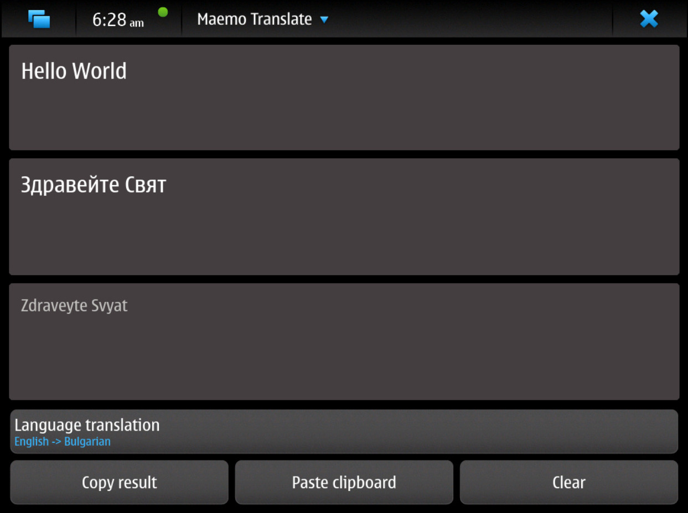

Maemo-translate
===================

Maemo Translate provides automated translation of text input. Unlike cloud-based 
alternatives, translation is done locally so that it does not leave the device. Built on 
top of [kotki](https://github.com/kroketio/kotki/).

### landscape


### potrait


## Models

The language models are available via debian packages on maemo leste, `apt search maemo-translate-data-*` to list 
them. You'll need to restart the GUI after installing new models.

## Credits

Maemo Translate borrows language models from the Mozilla extension "Firefox Translations" and uses 
technology that was developed with The Bergamot Project Consortium, coordinated by the 
University of Edinburgh with partners Charles University in Prague, the University of Sheffield, 
University of Tartu, and Mozilla.

#### hacking

```bash
sudo apt install -y qtbase5-dev ccache cmake libx11-dev zlib1g-dev libpng-dev libpcre2-dev libcli11-dev libcpuinfo-dev libsimde-dev libqt5svg5-dev libqt5maemo5-dev libqt5x11extras5-dev qtdeclarative5-dev qtdeclarative5-dev-tools libkotki
```